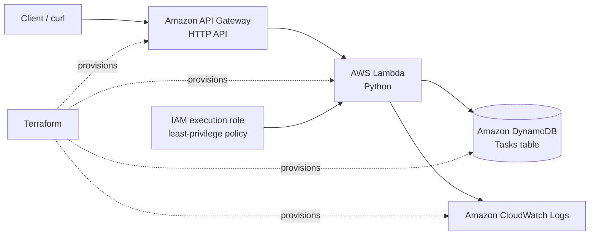
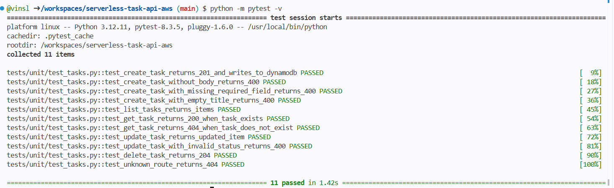
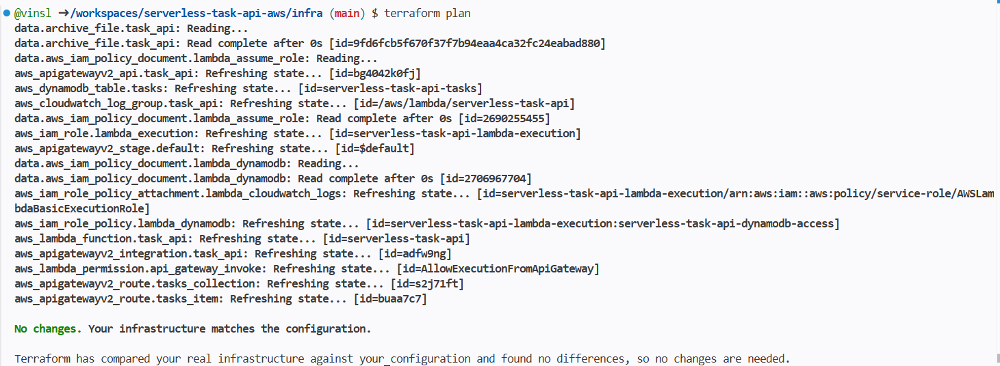
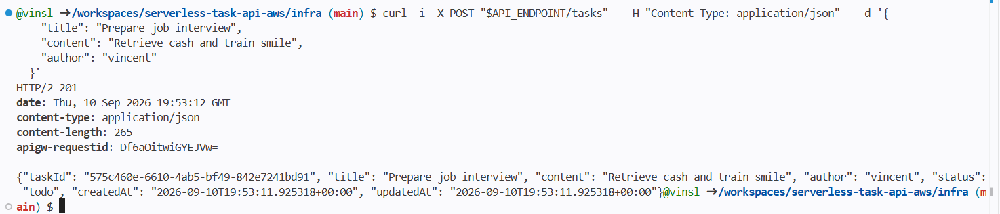
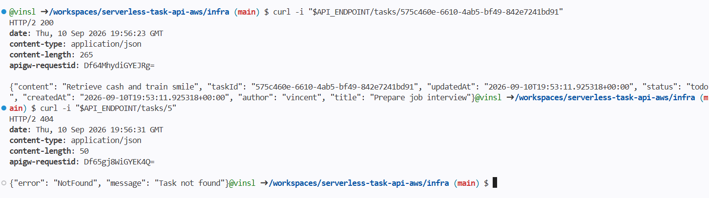

<a href="https://www.linkedin.com/in/vincent-lucas-483b29295/" target="_blank">LinkedIn</a>

# Serverless Task API on AWS

A small production-style REST API for managing tasks, built with AWS serverless services and provisioned entirely with Terraform.

The project was built as a hands-on cloud engineering exercise: write application code, test it locally, deploy reproducible infrastructure, validate the API end to end, inspect logs, and remove the resources cleanly afterwards.

> The AWS infrastructure is intentionally destroyed after validation to avoid unnecessary cloud costs. The repository contains the full Terraform configuration, application source code, tests, API contract, and deployment evidence.

## What it does

The API manages tasks with a simple CRUD workflow.

- Create a task with a title, content, and author.
- Retrieve all tasks.
- Retrieve one task by ID.
- Update a task title, content, or status.
- Delete a task.
- Return clear HTTP errors for invalid requests and missing resources.

Each task contains:

```json
{
  "taskId": "UUID generated by the API",
  "title": "Prepare Cloud Engineer job interview",
  "content": "Review IAM, Terraform and Lambda",
  "author": "vincent",
  "status": "todo",
  "createdAt": "ISO 8601 UTC timestamp",
  "updatedAt": "ISO 8601 UTC timestamp"
}
```

## Architecture

```text
Client
  |
  v
Amazon API Gateway HTTP API
  |
  v
AWS Lambda (Python)
  |
  v
Amazon DynamoDB
```



## AWS services and tools

| Technology | Purpose |
|---|---|
| Amazon API Gateway HTTP API | Exposes the public REST endpoints and forwards requests to Lambda |
| AWS Lambda | Runs the Python API handler without managing servers |
| Amazon DynamoDB | Stores task records using `taskId` as the primary key |
| AWS IAM | Gives Lambda only the permissions required for DynamoDB and CloudWatch Logs |
| Amazon CloudWatch Logs | Stores Lambda invocation and application logs |
| Terraform | Defines and provisions all AWS infrastructure |
| Python 3.12 | Implements the Lambda handler and unit tests |
| Pytest | Tests API routing, validation, DynamoDB interactions, and errors |
| Boto3 | Lets the Lambda function interact with DynamoDB |

## API contract

Base URL: Terraform output `api_endpoint`.

| Method | Endpoint | Description | Success response |
|---|---|---|---|
| `POST` | `/tasks` | Create a task | `201 Created` |
| `GET` | `/tasks` | List all tasks | `200 OK` |
| `GET` | `/tasks/{taskId}` | Get one task | `200 OK` |
| `PATCH` | `/tasks/{taskId}` | Update task fields | `200 OK` |
| `DELETE` | `/tasks/{taskId}` | Delete a task | `204 No Content` |

### Create a task

```bash
curl -i -X POST "$API_ENDPOINT/tasks" \
  -H "Content-Type: application/json" \
  -d '{
    "title": "Prepare Cloud Engineer job interview",
    "content": "Review IAM, Terraform and Lambda",
    "author": "vincent"
  }'
```

Required fields are `title`, `content`, and `author`. The API generates `taskId`, `status`, `createdAt`, and `updatedAt`.

### Update a task

```bash
curl -i -X PATCH "$API_ENDPOINT/tasks/<taskId>" \
  -H "Content-Type: application/json" \
  -d '{
    "status": "in_progress"
  }'
```

Allowed status values are:

```text
todo
in_progress
done
```

### Error responses

```json
{
  "error": "ValidationError",
  "message": "Human-readable explanation"
}
```

| Status | Meaning |
|---|---|
| `400 Bad Request` | Missing body, invalid JSON, missing or empty required field, invalid task status |
| `404 Not Found` | The route or task does not exist |
| `500 Internal Server Error` | An unexpected server-side or DynamoDB error occurred |

For the complete specification, see [docs/api-contract.md](docs/api-contract.md).

## Engineering decisions

### Input validation in Lambda

The Lambda validates the request body before interacting with DynamoDB. Empty payloads, invalid JSON, and invalid field values return `400 Bad Request` rather than leaking an internal exception.

### Server-controlled fields

The API, not the client, generates `taskId`, timestamps, and the initial `todo` status. This prevents clients from choosing IDs or manipulating creation metadata.

### Conditional DynamoDB writes

`POST` uses a conditional `put_item` operation to prevent overwriting an existing task ID. `PATCH` and `DELETE` require the item to exist, which lets the API return a proper `404` instead of silently creating or deleting nothing.

### Least-privilege IAM

The Lambda execution role is limited to the DynamoDB actions used by the application and to CloudWatch Logs write permissions. It does not receive broad AWS access.

### Observable and cost-aware

Lambda logs are collected in CloudWatch, and the log group retention is managed in Terraform. The complete stack can be recreated with `terraform apply` and removed with `terraform destroy`.

## Project structure

```text
.
├── src/
│   └── app.py                 # Lambda handler and CRUD logic
├── tests/
│   └── unit/
│       └── test_tasks.py      # Pytest unit tests with DynamoDB mocks
├── infra/
│   ├── api_gateway.tf         # HTTP API, routes and Lambda integration
│   ├── dynamodb.tf            # Tasks table
│   ├── iam.tf                 # Lambda execution role and policies
│   ├── lambda.tf              # Lambda package, function and CloudWatch log group
│   ├── providers.tf           # Terraform and AWS provider configuration
│   ├── outputs.tf             # API endpoint output
│   └── .terraform.lock.hcl    # Locked provider versions
├── docs/
│   └── api-contract.md        # API contract
├── resources/                 # Validation screenshots
├── requirements.txt
└── README.md
```

## Local testing

### Prerequisites

- Python 3.12 or newer
- Terraform
- AWS CLI configured with credentials for the target AWS account

Install Python dependencies:

```bash
python -m pip install -r requirements.txt
```

Run the unit test suite:

```bash
python -m pytest -v
```

The tests mock DynamoDB, so running them does not require AWS credentials and does not create cloud resources.

## Deploy with Terraform

From the `infra/` directory:

```bash
terraform init
terraform fmt
terraform validate
terraform plan
terraform apply
```

Terraform prints the API endpoint after a successful deployment:

```bash
export API_ENDPOINT="$(terraform output -raw api_endpoint)"
echo "$API_ENDPOINT"
```

The `.terraform.lock.hcl` file is versioned to make provider selection reproducible. The `.terraform/` directory and local Terraform state files are excluded from Git.

## Validation evidence

### Unit tests

The test suite covers successful CRUD operations, input validation, missing records, and unknown routes.



### Terraform convergence

After deployment, Terraform reports no drift between the AWS resources and the declared infrastructure.



### API task creation

A live `POST /tasks` request returned `201 Created` and produced a task with a generated UUID, timestamps, and initial `todo` status.



### Missing task handling

A request for an unknown task ID returned `404 Not Found` with the expected API error body.



## Cleanup

To avoid leaving chargeable cloud resources running, destroy the stack from `infra/`:

```bash
terraform plan -destroy
terraform destroy
```

Review the destroy plan before confirming. Terraform deletes only resources tracked in the current Terraform state; the configuration remains available to recreate the stack later.

## Possible next steps

- Add Amazon Cognito authentication and derive the task author from the JWT identity.
- Add pagination to `GET /tasks` instead of using a full DynamoDB scan.
- Add API Gateway request throttling and WAF protection.
- Add CloudWatch metrics, alarms, and a dashboard for Lambda errors and API latency.
- Add GitHub Actions to run Pytest, Terraform formatting, validation, and plan checks on pull requests.
- Add a remote Terraform backend with an S3 state bucket and DynamoDB locking.
- Add integration tests against a dedicated AWS test environment.

## Contact

- LinkedIn: [Vincent Lucas](https://www.linkedin.com/in/vincent-lucas-483b29295/)
- GitHub: [@vinsl](https://github.com/vinsl)
- Email: [vincentselucas@gmail.com](mailto:vincentselucas@gmail.com)